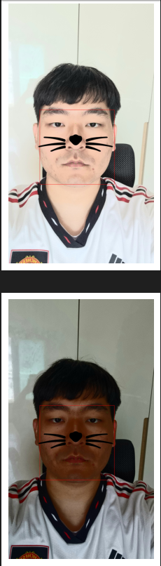
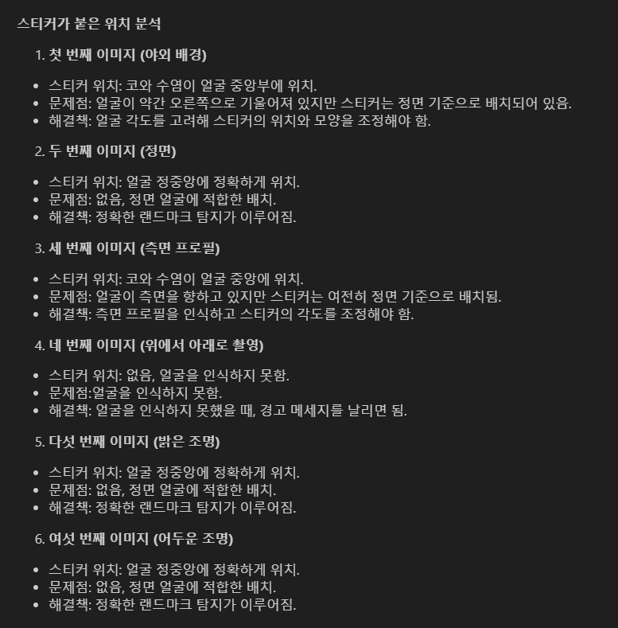
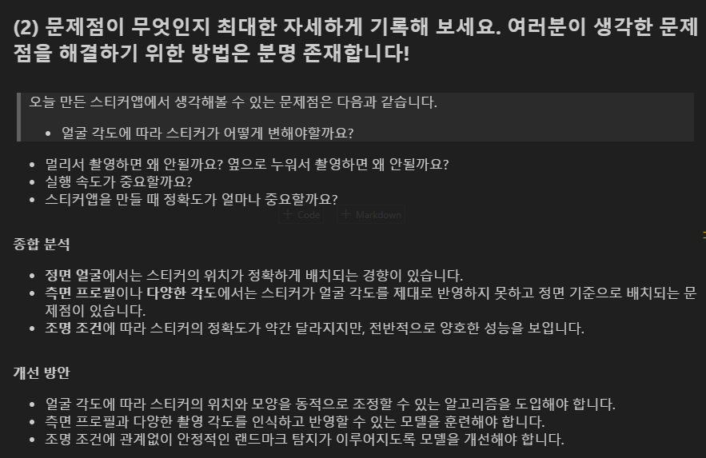
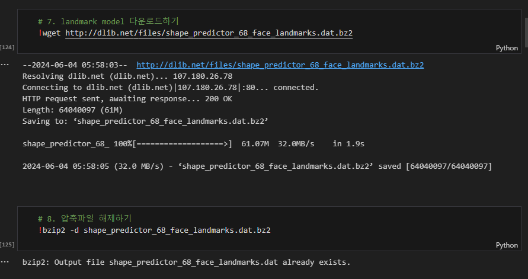

<aside>
🔑 **PRT(Peer Review Template)**

- [X]  **1. 주어진 문제를 해결하는 완성된 코드가 제출되었나요? (완성도)**
    - 문제에서 요구하는 최종 결과물이 첨부되었는지 확인
    - 문제를 해결하는 완성된 코드란 프로젝트 루브릭 3개 중 2개, 
    퀘스트 문제 요구조건 등을 지칭
        - 해당 조건을 만족하는 부분의 코드 및 결과물을 캡쳐하여 사진으로 첨부

- [x]  **2. 프로젝트에서 핵심적인 부분에 대한 설명이 주석(닥스트링) 및 마크다운 형태로 잘 기록되어있나요? (설명)**

- [X]  **3. 체크리스트에 해당하는 항목들을 모두 수행하였나요? (문제 해결)**

같은 환경에서 색조명만 변경을 해서 잘되는 지 여부의 체크도 어찌보면 쉽게 넘어갈 수 있던 부분이지만 잘 짚어서 좋았습니다.

- [X]  **4. 프로젝트에 대한 회고가 상세히 기록 되어 있나요? (회고, 정리)**
    - [X]  배운 점
    - [X]  아쉬운 점
    - [X]  느낀 점
    - [X]  어려웠던 점

</aside>

# 리뷰어 코멘트

코랩의 다른 환경에서 시행할 수 있도록 부분부분 코드들을 잘 안배해놓았다는 점이 좋았습니다.

측면에서 에러, 위에서의 에러 등등 여러 테스트 환경을 세팅하여 준비한점들이 인상 깊었습니다.

화이트닝, 어두움 등등 여러 조건들을 설정한것들이 잘보여서 좋았습니다.

추가적으로 개선할 수 있던 요소들이 분석해 아쉬운 점에 잘 작성한거 같아 좋았습니다.

이런식으로 코랩이든 개인환경이든 사용하기 좋게 정리해놓은점 좋았습니다.