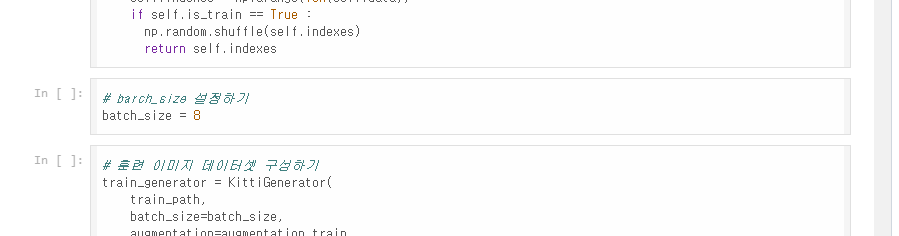
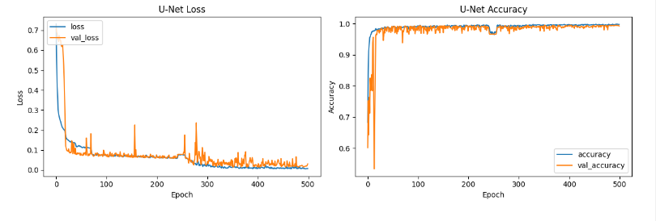
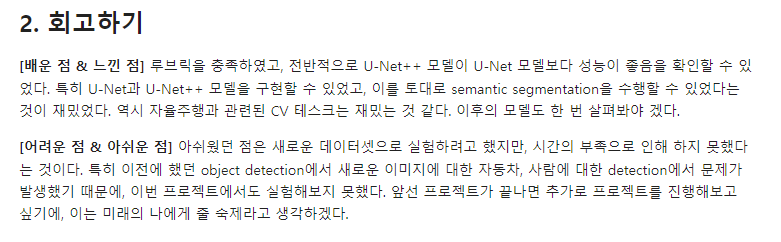

🔑 **PRT(Peer Review Template)**
코더: 고대현
리뷰어: 신재현

- [X]  **1. 주어진 문제를 해결하는 완성된 코드가 제출되었나요? (완성도)**
    - 문제에서 요구하는 최종 결과물이 첨부되었는지 확인
    - 문제를 해결하는 완성된 코드란 프로젝트 루브릭 3개 중 2개, 
    퀘스트 문제 요구조건 등을 지칭
        - 해당 조건을 만족하는 부분의 코드 및 결과물을 캡쳐하여 사진으로 첨부

- [X]  **2. 프로젝트에서 핵심적인 부분에 대한 설명이 주석(닥스트링) 및 마크다운 형태로 잘 기록되어있나요? (설명)**
    - [X]  모델 선정 이유
    - [X]  Metrics 선정 이유
    - [X]  Loss 선정 이유

학습의 배치사이즈가 초기에 너무 작게 잡혀있다는 포인트를 잡아 이 세부 파라미터들을 바꿔가며 비교하신점이 좋았습니다.

모델 학습을 500에폭까지 늘려 학습해보는 등 최적의 학습 지점을 찾기 위해 노력하셨습니다.

- [x]  **3. 체크리스트에 해당하는 항목들을 모두 수행하였나요? (문제 해결)**
    - [X]  데이터를 분할하여 프로젝트를 진행했나요? (train, validation, test 데이터로 구분)
    - [X]  하이퍼파라미터를 변경해가며 여러 시도를 했나요? (learning rate, dropout rate, unit, batch size, epoch 등)
    - [X]  각 실험을 시각화하여 비교하였나요?
    - [X]  모든 실험 결과가 기록되었나요?

간단하게 ipynb를 훑어보더라도 실행 결과들이 전부 세부적으로 잘 정리되어 실험이 진행되어 있습니다.

- [X]  **4. 프로젝트에 대한 회고가 상세히 기록 되어 있나요? (회고, 정리)**
    - [X]  배운 점
    - [X]  아쉬운 점
    - [X]  느낀 점
    - [X]  어려웠던 점

전반적으로 에폭을 늘려 2시간 넘게 학습을 진행하는등 최적의 결과를 위해 노력하신점이 많이 보여 놀라웠습니다.